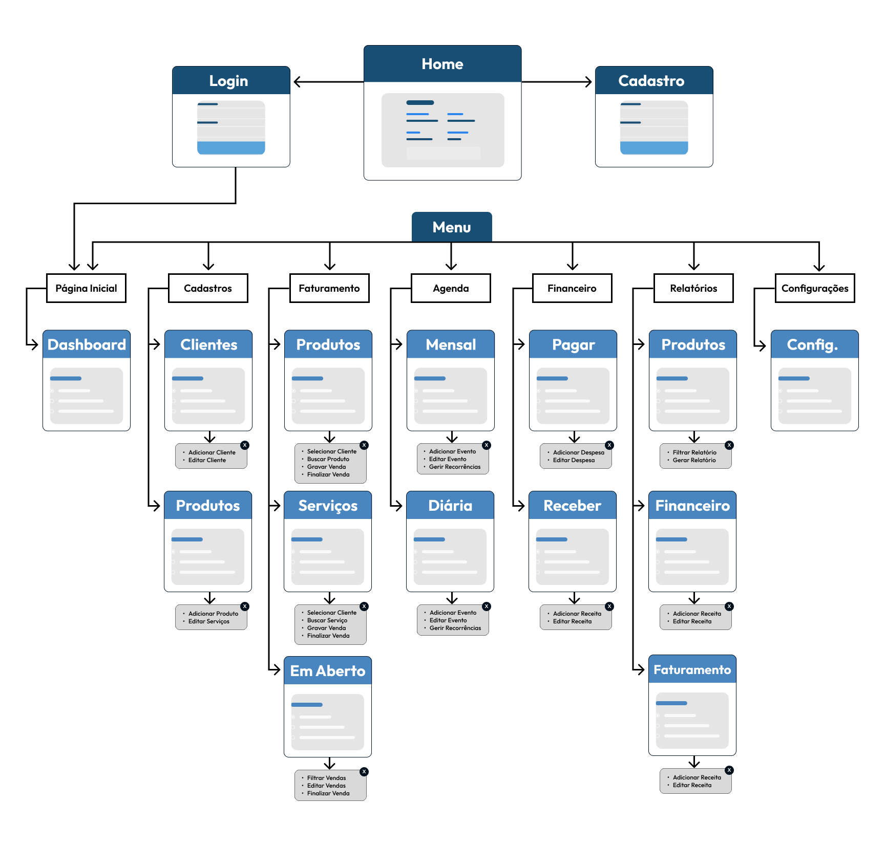

# Projeto de Interface

O projeto de interface do **Meu Negócio Fácil** foi desenvolvido com foco na usabilidade, em total alinhamento com os requisitos funcionais e não funcionais priorizados nas especificações do projeto. A arquitetura da informação foi estruturada para garantir uma jornada de usuário fluida e eficiente, permitindo rápida curva de aprendizado.

Com design minimalista e responsivo o sistema foi expresso em forma de protótipo, com características similares às reais. Além da responsividade, considerou-se aspectos de inclusão e design universal. A paleta de cores foi escolhida para garantir um bom contraste, facilitando a legibilidade, e a estrutura de navegação clara visa atender inclusive usuários com pouca familiaridade com tecnologia. O **Dashboard**, por exemplo, é chamado no menu de **Página Inicial**, podendo ser encontrado de forma fácil.

O fluxo de navegação está estruturado em módulos essenciais como: dashboard, cadastros, faturamento, agenda, financeiro e relatórios. Este fluxo foi projetado para espelhar as operações diárias de um pequeno negócio. A partir do **Página Inicial**, o usuário tem acesso rápido aos módulos essenciais. A estrutura ramificada, como em **Cadastros** que se divide em **Clientes/Fornecedores** e **Produtos/Serviços**, organiza as funcionalidades de forma lógica e escalável, permitindo que o usuário encontre facilmente o que precisa.

## User Flow

De forma a facilitar o entendimento, simplificamos os nomes de algumas telas no User Flow, conforme a tabela a seguir:  
| Caminho no Userflow | Caminho Completo | 
| ----------------|----------------------|
| Cadastros > Produtos | Cadastros > Produtos/Serviços | 
| Cadastros > Clientes | Cadastros > Clientes/Fornecedores | 
| Faturamento > Em Aberto | Faturamento > Vendas em Aberto | 
| Financeiro > Pagar | Financeiro > Contas a Pagar | 
| Financeiro > Receber | Financeiro > Contas a Receber | 
| Financeiro > Receber | Financeiro > Contas a Receber | 
| Relatórios > Produtos | Relatórios > Produtos/Serviços | 

## Wireframes

### 1. Home

Landing page da plataforma acessível a qualquer pessoa. Permite a visão geral e apresentação das principais funcionalidades e recursos disponíveis.

### 2.  Login

Pagina de acesso para usuários já cadastrados, entrada com login e senha. Representa o Requisito Funcional RF-01.

### 3. Cadastro

Pagina para cadastro de novos usuários. Representa o Requisito Funcional RF-01.

### 4. Dashboard

Página inicial que contém visão geral, meta de vendas, ou outros dados. Representa o Requisito Funcional RF-02.

### 5. Cadastros - Clientes/Fornecedores

Pagina que permite novos cadastros e contém informações de clientes ou fornecedores já cadastrados junto às informações de cada cadastro, com filtro e busca. Representa o Requisito Funcional RF-03.

### 6. Cadastros - NOVO Clientes/Fornecedores

Pagina para novos cadastro de clientes e fornecedores. Representa o Requisito Funcional RF-03.

### 7. Cadastros - Produtos/Serviços

Pagina que permite novos cadastros e contém informações de produtos e serviços já cadastrados junto às informações de cada cadastro, com filtro e busca. Representa o Requisito Funcional RF-04.

### 8. Cadastros - NOVO Produtos/Serviços

Pagina para cadastro de novos produtos ou serviços. Representa o Requisito Funcional RF-04.

### 9. Faturamento de Produto

Pagina para registro de nova venda de produto com informações necessárias para a venda, como produto, quantidade, cliente e forma de pagamento. Representa o Requisito Funcional RF-05.

### 10. Faturamento de Serviço

Pagina para registro de nova venda de serviço com informações necessárias para a venda, como serviço, insumos, cliente e forma de pagamento. Representa o Requisito Funcional RF-06.

### 11. Faturamento/vendas em aberto

Pagina com informações de vendas salvas como em aberto, que podem ser editadas ou excluídas. Representa o Requisito Funcional RF-07.

### 12. Agenda

Pagina com calendário de todos os compromissos mensais, diários e permite o cadastro de novos compromissose gestão de recorrências. Representa o Requisito Funcional RF-09.

### 13. Financeiro/conta a pagar

Pagina que contém as contas a pagar, suas informações, e permite o cadastro de novas contas. Representa o Requisito Funcional RF-08.

### 14. Financeiro/contas a receber

Pagina que contém as contas a receber, suas informações, e permite o cadastro de novas contas. Representa o Requisito Funcional RF-08.

### 15. Relatórios/Produtos e Serviços

Pagina de relatórios sobre produtos ou serviços com informações como quantidade de venda, estoque e tabela de preços. Representa o Requisito Funcional RF-12.

### 16. Relatório/Financeiro

Pagina que mostra um relatório financeiro em forma de gráfico que contem informações de fluxo de caixa despesas e receitas anual, e pode conter faturas pagas, a pagar e recebidas. Representa o Requisito Funcional RF-11.

### 17. Relatório/Faturamento

Página que exibe relatórios de vendas e serviços realizados. Representa o Requisito Funcional RF-10.

### 18. Configurações

Pagina com opções de configuração do cadastro de usuário.

 

