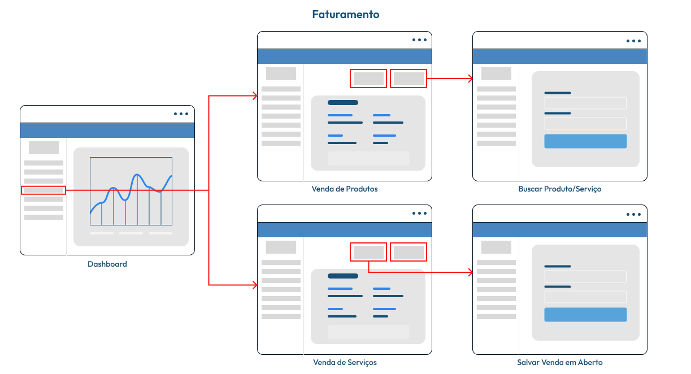
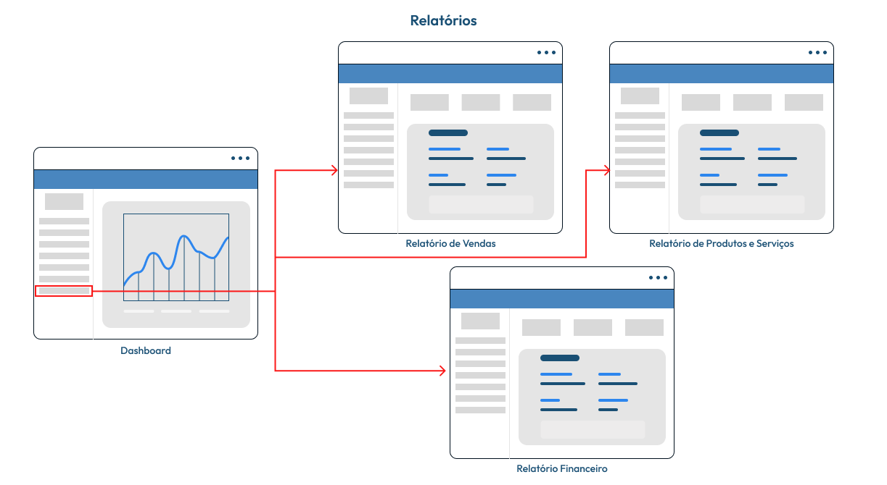
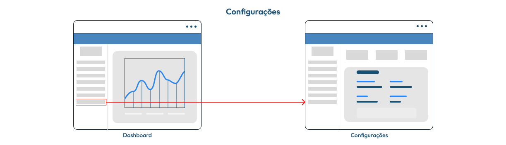

# Projeto de Interface

O projeto de interface do Meu Negócio Fácil foi focado em usabilidade, em alinhamento com os requisitos priorizados nas especificações de projeto. O fluxo de navegação está estruturado em módulos essenciais, como: dashboard, cadastros, faturamento, agenda, financeiro, relatórios e configurações. Já o design minimalista e responsivo foi expressado na forma de protótipo, com características similares às reais do sistema.

## User Flow

## Wireframes

São protótipos usados em design de interface para sugerir a estrutura de um site web e seu relacionamentos entre suas páginas. Um wireframe web é uma ilustração semelhante do layout de elementos fundamentais na interface e é fundamental sempre relacionar cada wireframe com o(s) requisito(s) que ele atende.

### Exemplo

A tela inicial apresenta um menu lateral com as principais seções do portal, enquanto a navigation bar, ao topo, apresenta informações de envio de imagens ou navegação pela galeria de fotos. A área central apresenta a galeria de fotos na forma de uma grade. Nesta tela, são apresentados os seguintes requisitos

 
> **Links Úteis**:
> - [Protótipos vs Wireframes](https://www.nngroup.com/videos/prototypes-vs-wireframes-ux-projects/)
> - [Ferramentas de Wireframes](https://rockcontent.com/blog/wireframes/)
> - [MarvelApp](https://marvelapp.com/developers/documentation/tutorials/)
> - [Figma](https://www.figma.com/)
> - [Adobe XD](https://www.adobe.com/br/products/xd.html#scroll)
> - [Axure](https://www.axure.com/edu) (Licença Educacional)
> - [InvisionApp](https://www.invisionapp.com/) (Licença Educacional)
