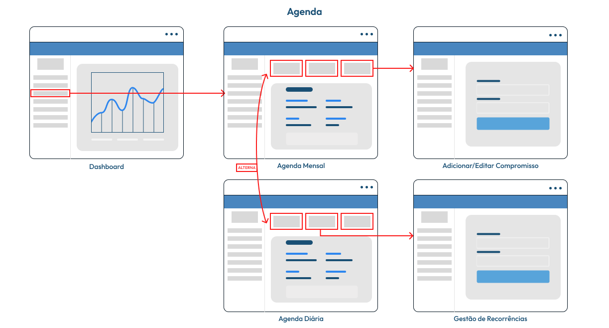

# Projeto de Interface

O projeto de interface do **Meu Negócio Fácil** foi construído com foco na usabilidade, em alinhamento com os requisitos priorizados nas especificações de projeto. O fluxo de navegação está estruturado em módulos essenciais como: dashboard, cadastros, faturamento, agenda, financeiro e relatórios. Já o design minimalista e responsivo foi expressado na forma de protótipo, com características similares às reais que o  sistema terá.

## User Flow

## Wireframes

### Exemplo

A tela inicial apresenta um menu lateral com as principais seções do portal, enquanto a navigation bar, ao topo, apresenta informações de envio de imagens ou navegação pela galeria de fotos. A área central apresenta a galeria de fotos na forma de uma grade. Nesta tela, são apresentados os seguintes requisitos

