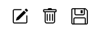

# Template padrão do site

## Design

A identidade visual do **Meu Negócio Fácil** foi pensada com para ser o mais minimalista e interativa possível. Escolheu-se uma interface clean, facilitando a navegação e otimizando a experiência de uso, em alinhamento com as especificações do projeto.

Foi construído também o layout em HTML/CSS, que pode ser acessado aqui:  
* ## [Acessar Template](https://icei-puc-minas-pmv-si.github.io/pmv-si-2025-2-pe1-t1-pmv-si-2025-2-pe1-projmeunegociofacil/template/index.html)
* ## [Acessar Código-Fonte](template/index.html)

## Cores

Seguindo a estratégia de ser o mais intuitivo possível, o sistema será todo construído com base nas cores da marca **Meu Negócio Fácil**.

## Tipografia

Para a tipografia, foi escolhida a fonte **Outfit**, disponível no Google Fonts sob licença aberta. A escolha se justifica por sua legibilidade e versatilidade, oferecendo pesos que vão do ExtraLight ao Bold, permitindo uma hierarquia visual clara e consistente, contribuindo para a usabilidade e a estética minimalista do projeto.

| Tag Html | Uso | Fonte | Tamanho |
|-----------|-----|---------|-----------|
| h1 | Títulos de Página | Outfit Bold | 40 px |
| h2 | Títulos de Seção | Outfit SemiBold | 32 px |
| h3 | Subtítulos | Outfit Bold | 28 px |
| p | Parágrafos | Outfit Regular | 16 px |
| small | Legendas | Outfit Regular | 14 px |

## Iconografia

A iconografia do sistema foi selecionada para ser facilmente reconhecível e consistente com a proposta visual minimalista. Os ícones facilitam a identificação rápida das funcionalidades, tornando a navegação mais ágil e intuitiva.

Ícone do site no navegador (favicon)
 

Icone alusivo à Página Inicial  
 

Icone alusivo à tela de Cadastros  
  

Icone alusivo à tela de Faturamento  
  

Icone alusivo à tela de Agenda e alternância entre agenda diária e agenda mensal  
  

Icone alusivo à tel Financeiro  
  

Icone alusivo à tela Relatórios e Filtros  
  

Icone alusivo à tela Configurações  
 

Botões de Ação (Edição, Gravação e Deleção)  
  
