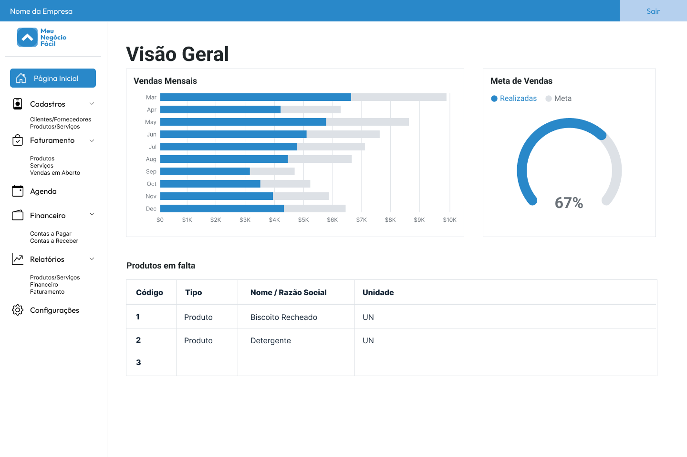
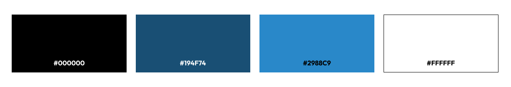

# Template padrão do site

## Design

Toda a identidade visual do **Meu Negócio Fácil** foi pensada com o intuito de ser o mais minimalista e intuitiva possivel.

Foi construído também o layout em HTML/CSS, que pode ser acessado aqui:  
* ## [Acessar Template](https://icei-puc-minas-pmv-si.github.io/pmv-si-2025-2-pe1-t1-pmv-si-2025-2-pe1-projmeunegociofacil/template/index.html)
* ## [Acessar Código-Fonte](template/index.html)

## Cores

## Tipografia

Apresente as fontes que serão utilizadas e sua função no site. As principais funções são: Título de página, Título de Seção, Rótulos de componentes e Corpo de Texto.

## Iconografia

Defina os ícones que serão utilizados e suas respectivas funções.

Apresente os estilos CSS criados para cada um dos elementos apresentados.
Outras seções podem ser adicionadas neste documento para apresentar padrões de componentes, de menus, etc.

> **Links Úteis**:
>
> -  [Como criar um guia de estilo de design da Web](https://edrodrigues.com.br/blog/como-criar-um-guia-de-estilo-de-design-da-web/#)
> - [CSS Website Layout (W3Schools)](https://www.w3schools.com/css/css_website_layout.asp)
> - [Website Page Layouts](http://www.cellbiol.com/bioinformatics_web_development/chapter-3-your-first-web-page-learning-html-and-css/website-page-layouts/)
> - [Perfect Liquid Layout](https://matthewjamestaylor.com/perfect-liquid-layouts)
> - [How and Why Icons Improve Your Web Design](https://usabilla.com/blog/how-and-why-icons-improve-you-web-design/)