# Testes

Neste projeto serão realizados dois tipos de testes:

 - O **Teste de Software**, que utiliza uma abordadem de caixa preta, e tem por objetivo verificar a conformidade do software com os requisitos funcionais e não funcionais do sistema.
 - O **Teste de Usabilidade**, que busca avaliar a qualidade do uso do sistema por um usuário do público alvo. 

<!-- Se quiser conhecer um pouco mais sobre os tipos de teste de software, leia o documento [Teste de Software: Conceitos e tipos de testes](https://blog.onedaytesting.com.br/teste-de-software/). -->

A documentação dos testes é dividida nas seguintes seções:

 - [Plano de Testes de Software](#plano-de-testes-de-software)
 - [Registro dos Testes de Software](#registro-dos-testes-de-software)
 - [Avaliação dos Testes de Software](#avaliação-dos-testes-de-software)
 - [Cenários de Teste de Usabilidade](#cenários-de-teste-de-usabilidade)
 - [Registro dos Testes de Usabilidade](#registro-dos-testes-de-usabilidade)
 - [Avaliação dos Testes de Usabilidade](#avaliação-dos-testes-de-usabilidade)

# Teste de Software

Este documento detalha o plano de testes para o sistema "Meu Negócio Fácil", com base nos requisitos funcionais (RF) e não funcionais (RNF) definidos. O objetivo é validar o funcionamento de cada módulo e garantir a conformidade com as especificações.

## Plano de Testes de Software

Abaixo estão detalhados os casos de teste (CT) a serem executados.

---

**Caso de Teste** | **CT01 - Cadastro de Novo Usuário (Sucesso)**
:--- | :---
**Procedimento** | 1) Acessar a **Home**.   2) Clicar no botão "Efetuar Cadastro".   3) Preencher todos os campos do formulário no modal com dados válidos.   4) Certificar que os campos "Senha" e "Repita a Senha" são idênticos.   5) Clicar no botão "Efetuar Cadastro" do modal.
**Requisitos associados** | RF-01
**Resultado esperado** | O modal de cadastro é fechado e um alerta de sucesso (ex: "Usuário salvo com sucesso") é exibido.
**Dados de entrada** | Dados de usuário válidos, senhas coincidentes.
**Resultado obtido** | Sucesso

---

**Caso de Teste** | **CT02 - Cadastro de Novo Usuário (Falha - Senha Divergente)**
:--- | :---
**Procedimento** | 1) Acessar **Home**.   2) Clicar em "Efetuar Cadastro".   3) Preencher todos os campos, mas inserir valores diferentes em "Senha" e "Repita a Senha".   4) Clicar no botão "Efetuar Cadastro" do modal.
**Requisitos associados** | RF-01
**Resultado esperado** | Um alerta (ex: "As senhas informadas não conferem") é exibido e o cadastro não é concluído.
**Dados de entrada** | Dados de usuário válidos, senhas divergentes.
**Resultado obtido** | Sucesso

---

**Caso de Teste** | **CT03 - Login de Usuário (Sucesso)**
:--- | :---
**Procedimento** | 1) Acessar **Home**.   2) Clicar no botão "Login".   3) Preencher o e-mail e a senha com dados de um usuário válido (ex: 'teste@teste.com', '1234').   4) Clicar no botão "Efetuar Login".
**Requisitos associados** | RF-01, RNF-01
**Resultado esperado** | O usuário é autenticado e redirecionado para a página **Dashboard**.
**Dados de entrada** | E-mail: 'admin@admin.com', Senha: 'admin'
**Resultado obtido** | Sucesso

---

**Caso de Teste** | **CT04 - Login de Usuário (Falha - Senha Inválida)**
:--- | :---
**Procedimento** | 1) Acessar **Home**.   2) Clicar no botão "Login".   3) Preencher com um e-mail válido e uma senha inválida.   4) Clicar no botão "Efetuar Login".
**Requisitos associados** | RF-01, RNF-01
**Resultado esperado** | Um alerta (ex: "Usuário ou senha incorretos") é exibido e o usuário permanece na **Home**.
**Dados de entrada** | E-mail: 'teste@teste.com', Senha: 'invalid'
**Resultado obtido** | Sucesso

---

**Caso de Teste** | **CT05 - Visualização do Dashboard e Verificação de Acesso**
:--- | :---
**Procedimento** | 1) Efetuar login com sucesso (CT03).   2) Ao ser redirecionado para o **Dashboard**, verificar os elementos da página.   3) Tentar acessar **Dashboard** diretamente em uma nova sessão (sem login) e verificar se é redirecionado para o login.
**Requisitos associados** | RF-02, RNF-01
**Resultado esperado** | O dashboard é exibido corretamente após o login, mostrando o nome do usuário, gráficos e tabelas. O acesso direto sem login falha (redireciona para a **Home**).
**Dados de entrada** | N/A (Navegação)
**Resultado obtido** | Sucesso

---

**Caso de Teste** | **CT06 - Adicionar Novo Cliente**
:--- | :---
**Procedimento** | 1) Navegar para **Clientes e Fornecedores**.   2) Clicar no botão "Novo Cliente/Fornecedor".   3) No modal, preencher Código, selecionar "Cliente" no Tipo, Nome e CPF/CNPJ.   4) Clicar em "Salvar".
**Requisitos associados** | RF-03
**Resultado esperado** | O modal é fechado e o novo cliente é adicionado e exibido na tabela da página principal.
**Dados de entrada** | Código: 10, Tipo: Cliente, Nome: "Teste Cliente", Documento: "111.111.111-11"
**Resultado obtido** | Sucesso

---

**Caso de Teste** | **CT07 - Buscar Cliente/Fornecedor**
:--- | :---
**Procedimento** | 1) Navegar para **Clientes e Fornecedores**.   2) Digitar um termo de busca (ex: "Maria") no campo "Buscar".
**Requisitos associados** | RF-03
**Resultado esperado** | A tabela é filtrada dinamicamente para exibir apenas os registros que contêm o termo "Maria" (com base nos dados mocados ou adicionados).
**Dados de entrada** | Termo de busca: "Maria"
**Resultado obtido** | Sucesso

---

**Caso de Teste** | **CT08 - Excluir Cliente/Fornecedor**
:--- | :---
**Procedimento** | 1) Navegar para **Clientes e Fornecedores**.   2) Localizar um registro na tabela.   3) Clicar no ícone de lixeira (excluir) referente a esse registro.   4) Confirmar a exclusão na caixa de diálogo do navegador (confirm).
**Requisitos associados** | RF-03
**Resultado esperado** | O registro é removido da tabela.
**Dados de entrada** | N/A (Confirmação de exclusão)
**Resultado obtido** | Sucesso

---

**Caso de Teste** | **CT09 - Adicionar Novo Produto**
:--- | :---
**Procedimento** | 1) Navegar para **Produtos e Serviços**.   2) Clicar no botão "Novo Produto/Serviço".   3) No modal, preencher Código, selecionar "Produto" no Tipo, Descrição e Unidade.   4) Clicar em "Salvar".
**Requisitos associados** | RF-04
**Resultado esperado** | O modal é fechado e o novo produto é adicionado e exibido na tabela da página principal.
**Dados de entrada** | Código: 100, Tipo: Produto, Descrição: "Produto Teste", Unidade: "PC"
**Resultado obtido** | Sucesso

---

**Caso de Teste** | **CT10 - Adicionar Novo Serviço**
:--- | :---
**Procedimento** | 1) Navegar para **Produtos e Serviços**.   2) Clicar no botão "Novo Produto/Serviço".   3) No modal, preencher Código, selecionar "Serviço" no Tipo, Descrição e Unidade (ex: HORA).   4) Clicar em "Salvar".
**Requisitos associados** | RF-04
**Resultado esperado** | O modal é fechado e o novo serviço é adicionado e exibido na tabela da página principal.
**Dados de entrada** | Código: 101, Tipo: Serviço, Descrição: "Consultoria", Unidade: "HORA"
**Resultado obtido** | Sucesso

---

**Caso de Teste** | **CT11 - Lançar Venda de Produto (PDV)**
:--- | :---
**Procedimento** | 1) Navegar para **Faturamento de Produtos**.   2) Clicar em "Consumidor Final" para abrir o modal de seleção de cliente e selecionar um.   3) Digitar um código de produto válido no campo "Digite o código" e pressionar Enter.   4) Alternativamente, clicar em "Buscar Produto", selecionar um produto no modal e fechar.
**Requisitos associados** | RF-05
**Resultado esperado** | O produto é adicionado à lista de "Produtos" na tabela, e o "Total" no rodapé é atualizado.
**Dados de entrada** | Código de produto válido.
**Resultado obtido** | Sucesso

---

**Caso de Teste** | **CT12 - Finalizar Venda de Produto (Pagamento)**
:--- | :---
**Procedimento** | 1) Em **Faturamento de Produtos**, após adicionar produtos (CT11).   2) Clicar em "Efetuar Pagamento".   3) No modal "Efetuar Pagamento", selecionar uma Forma de Pagamento (ex: "Dinheiro").   4) Clicar em "Finalizar Venda".
**Requisitos associados** | RF-05
**Resultado esperado** | O modal de pagamento é fechado e o modal "Concluído com sucesso" é exibido. A venda é limpa da tela.
**Dados de entrada** | Forma de Pagamento: "Dinheiro"
**Resultado obtido** | Sucesso

---

**Caso de Teste** | **CT13 - Lançar Venda de Serviço**
:--- | :---
**Procedimento** | 1) Navegar para **Faturamento de Serviços**.   2) Selecionar um cliente (similar ao CT11).   3) Clicar em "Buscar Serviço" e selecionar um serviço no modal.
**Requisitos associados** | RF-06
**Resultado esperado** | O serviço é adicionado à lista na tabela e o "Total" é atualizado.
**Dados de entrada** | Seleção de serviço no modal.
**Resultado obtido** | Sucesso

---

**Caso de Teste** | **CT14 - Adicionar Insumo ao Serviço**
:--- | :---
**Procedimento** | 1) Em **Faturamento de Serviços**, após adicionar um serviço (CT13).   2) Clicar em "Adicionar Insumo".   3) Preencher o modal "Adicionar Insumo" (Quantidade, Valor Unitário, Descrição).   4) Clicar em "Salvar".
**Requisitos associados** | RF-06
**Resultado esperado** | O modal é fechado, o insumo é listado na seção "Insumos" (abaixo da tabela principal) e o "Total" geral é recalculado para incluir o valor do insumo.
**Dados de entrada** | Qtd: 2, Valor Unitário: 10.00, Descrição: "Parafuso"
**Resultado obtido** | Sucesso

---

**Caso de Teste** | **CT15 - Gravar Venda como "Em Aberto"**
:--- | :---
**Procedimento** | 1) Em **Faturamento** de **Produtos ou Faturameno de Serviços**, adicionar itens e um cliente.   2) Clicar no botão "Gravar".   3) Preencher o nome do cliente no modal "Gravar Venda" e clicar em "Salvar".   4) Navegar para **Vendas em Aberto**.
**Requisitos associados** | RF-05, RF-06, RF-07
**Resultado esperado** | A venda gravada aparece na lista da tabela em **Vendas em Aberto**.
**Dados de entrada** | Nome do cliente no modal "Gravar".
**Resultado obtido** | Sucesso

---

**Caso de Teste** | **CT16 - Editar Venda "Em Aberto"**
:--- | :---
**Procedimento** | 1) Navegar para **Vendas em Aberto**.   2) Localizar uma venda gravada (do CT15).   3) Clicar no ícone de lápis (editar) correspondente.
**Requisitos associados** | RF-07
**Resultado esperado** | O usuário é redirecionado de volta para a tela de faturamento (produtos ou serviços) com todos os dados da venda (cliente, itens) pré-carregados para edição.
**Dados de entrada** | N/A (Navegação)
**Resultado obtido** | Sucesso

---

**Caso de Teste** | **CT17 - Adicionar Nova Conta a Pagar**
:--- | :---
**Procedimento** | 1) Navegar para **Contas a Pagar**.   2) Clicar em "+ Nova Conta".   3) Preencher o modal "Adicionar Nova Conta a Pagar" (Status, Tipo, Valor, Descrição, Vencimento).   4) Clicar em "Salvar".
**Requisitos associados** | RF-08
**Resultado esperado** | O modal é fechado e a nova conta é adicionada e exibida na tabela.
**Dados de entrada** | Status: Pendente, Tipo: "Fornecedor", Valor: 200.00, Descrição: "Material Escritório"
**Resultado obtido** | Sucesso

---

**Caso de Teste** | **CT18 - Adicionar Nova Conta a Receber**
:--- | :---
**Procedimento** | 1) Navegar para **Contas a Receber**.   2) Clicar em "Nova Fatura".   3) Preencher o modal "Adicionar/Editar Conta a Receber" (Status, Tipo, Cliente, Descrição, Vencimento, Valor).   4) Clicar em "Salvar".
**Requisitos associados** | RF-08
**Resultado esperado** | O modal é fechado e a nova fatura é adicionada e exibida na tabela.
**Dados de entrada** | Status: Pendente, Tipo: "Serviço", Cliente: "Cliente Teste", Valor: 500.00
**Resultado obtido** | Sucesso

---

**Caso de Teste** | **CT19 - Adicionar Compromisso na Agenda**
:--- | :---
**Procedimento** | 1) Navegar para **Agenda**.   2) Clicar em "Novo Compromisso".   3) No modal, inserir a "Descrição do Compromisso" e a "Data do Compromisso".   4) Clicar em "Salvar".
**Requisitos associados** | RF-09
**Resultado esperado** | O modal é fechado. (A validação visual do evento no calendário depende da implementação JS da agenda).
**Dados de entrada** | Descrição: "Reunião Equipe", Data: (data futura)
**Resultado obtido** | Sucesso

---

**Caso de Teste** | **CT20 - Alternar Visualização da Agenda (Diário/Mensal)**
:--- | :---
**Procedimento** | 1) Navegar para **Agenda**.   2) Clicar no botão "Diário/Mensal".
**Requisitos associados** | RF-09
**Resultado esperado** | A visualização da agenda alterna entre a exibição do calendário mensal e a exibição da agenda diária (por horas).
**Dados de entrada** | N/A (Clique)
**Resultado obtido** | Sucesso

---

**Caso de Teste** | **CT21 - Teste de Responsividade (Menu Sidebar)**
:--- | :---
**Procedimento** | 1) Acessar qualquer página logada (ex: **Dashboard**) em um desktop.   2) Reduzir a largura da janela do navegador (simulando um dispositivo móvel).   3) Observar o menu lateral.   4) Clicar no botão "hamburger" (ícone de lista) que aparece no topo.
**Requisitos associados** | RNF-02
**Resultado esperado** | Em larguras menores, o menu lateral (sidebar) desaparece. O botão "hamburger" é exibido. Ao clicar no botão, o menu (offcanvas) desliza para a tela.
**Dados de entrada** | N/A (Redimensionamento de tela)
**Resultado obtido** | Sucesso

---

**Caso de Teste** | **CT22 - Interação com Filtros (Relatório Produtos/Serviços)**
:--- | :---
**Procedimento** | 1) Acessar **Relatório de Produtos e Serviços** (após login).   2) Interagir com os campos de filtro (Tipo, Fornecedor, Produtos/Serviços, Saldo).   3) Clicar no botão "Filtrar".
**Requisitos associados** | RF-10, RNF-01
**Resultado esperado** | A página permite a seleção de valores nos filtros e o clique no botão "Filtrar" (a ação de filtragem real depende do backend, mas a interação da interface é testada). O acesso sem login é bloqueado.
**Dados de entrada** | N/A (Interação com a UI)
**Resultado obtido** | Sucesso

---

**Caso de Teste** | **CT23 - Interação com Filtros (Relatório Financeiro)**
:--- | :---
**Procedimento** | 1) Acessar **Relatório Financeiro** (após login).   2) Interagir com os campos de filtro (Período, Status, Tipo, Cliente/Fornecedor).   3) Clicar no botão "Filtrar".
**Requisitos associados** | RF-11, RNF-01
**Resultado esperado** | A página permite a seleção de valores nos filtros e o clique no botão "Filtrar". O gráfico SVG e a tabela são exibidos. O acesso sem login é bloqueado.
**Dados de entrada** | N/A (Interação com a UI)
**Resultado obtido** | Sucesso

---

**Caso de Teste** | **CT24 - Interação com Filtros (Relatório Faturamento)**
:--- | :---
**Procedimento** | 1) Acessar **Relatório de Faturamento** (após login).   2) Interagir com os campos de filtro (Período, Tipo, Forma de Pagamento).   3) Clicar no botão "Filtrar".
**Requisitos associados** | RF-12, RNF-01
**Resultado esperado** | A página permite a seleção de valores nos filtros e o clique no botão "Filtrar". O acesso sem login é bloqueado (verificado pelo script `if (!loggedUser())`).
**Dados de entrada** | N/A (Interação com a UI)
**Resultado obtido** | Sucesso

---

**Caso de Teste** | **CT25 - Teste de Usabilidade (Consistência da Interface)**
:--- | :---
**Procedimento** | 1) Efetuar login.   2) Navegar entre **Dashboard**, **Clientes e Fornecedores**, **Produtos e Serviços**, **Faturamento de Produtos**, **Faturamento de Serviços**, **Vendas em Aberto**, **Agenda**, **Relatório Financeiro**, **Relatório Faturamento**, **Relatório de Produtos e Serviços** e **Configurações**.   3) Observar o layout geral.
**Requisitos associados** | RNF-04
**Resultado esperado** | Todas as páginas logadas exibem o mesmo Topbar (barra azul com "Olá, [Nome]" e "Logout") e o mesmo menu lateral (Sidebar/Offcanvas). O estilo visual (botões, fontes) é consistente.
**Dados de entrada** | N/A (Navegação)
**Resultado obtido** | Sucesso

## Registro dos Testes de Software

Esta seção apresenta o relatório com as evidências dos testes de software realizados no sistema pela equipe, baseado no plano de testes pré-definido.

| **Caso de Teste** | **CT01 - Cadastro de Novo Usuário (Sucesso)** |
| :--- | :--- |
| **Requisito Associado** | **RF-01** - O sistema deve permitir o cadastro de usuários e login com email e senha. |
| **Evidência do Teste:** | 

📷 Ver Imagem
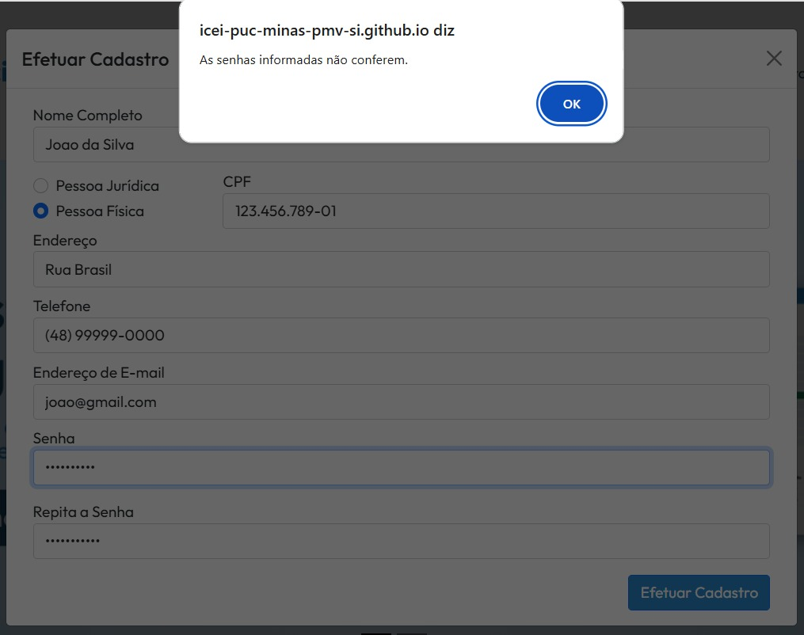
 |

| **Caso de Teste** | **CT02 - Cadastro de Novo Usuário (Falha - Senha Divergente)** |
| :--- | :--- |
| **Requisito Associado** | **RF-01** - O sistema deve permitir o cadastro de usuários e login com email e senha. |
| **Evidência do Teste:** | 

📷 Ver Imagem
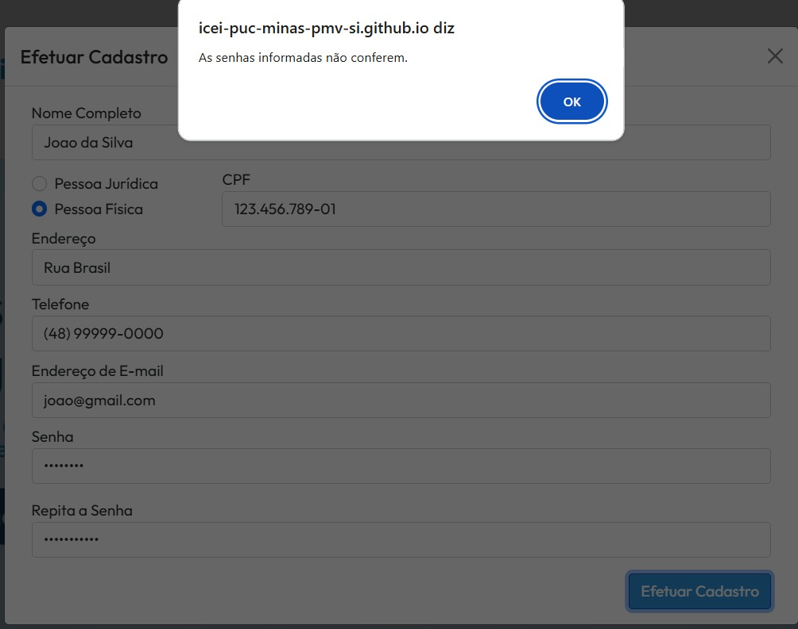
 |

| **Caso de Teste** | **CT03 - Login de Usuário (Sucesso)** |
| :--- | :--- |
| **Requisito Associado** | **RF-01** - O sistema deve permitir o cadastro de usuários e login com email e senha.   **RNF-01** - A interface deve ser minimalista e proporcionar um aprendizado rápido. |
| **Evidência do Teste:** | 

📷 Ver Imagem
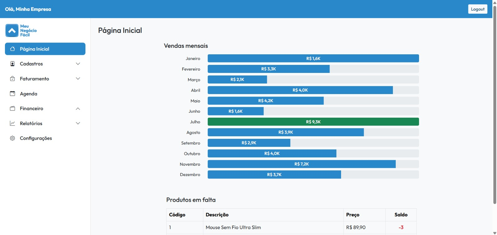
 |

| **Caso de Teste** | **CT04 - Login de Usuário (Falha - Senha Inválida)** |
| :--- | :--- |
| **Requisito Associado** | **RF-01** - O sistema deve permitir o cadastro de usuários e login com email e senha.   **RNF-01** - A interface deve ser minimalista e proporcionar um aprendizado rápido. |
| **Evidência do Teste:** | 

📷 Ver Imagem
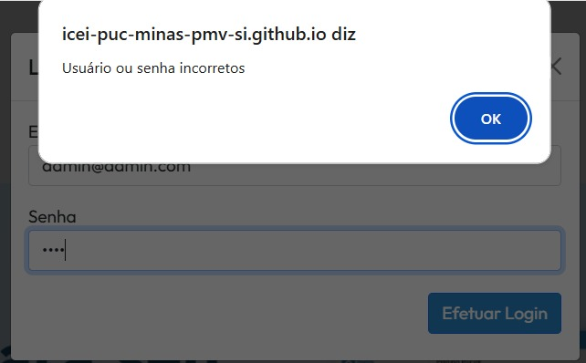
 |

| **Caso de Teste** | **CT05 - Visualização do Dashboard e Verificação de Acesso** |
| :--- | :--- |
| **Requisito Associado** | **RF-02** - O sistema deve exibir na tela inicial um dashboard mostrando informações relevantes, como as vendas do mês.   **RNF-01** - A interface deve ser minimalista e proporcionar um aprendizado rápido. |
| **Evidência do Teste:** | 

📷 Ver Imagem
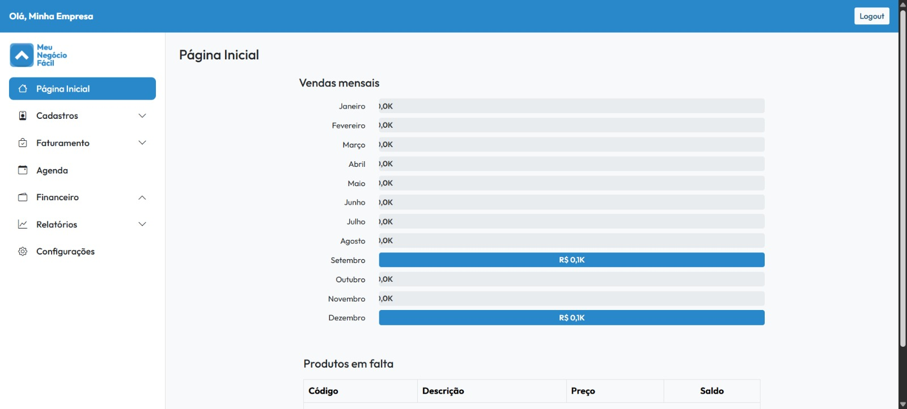
 |

| **Caso de Teste** | **CT06 - Adicionar Novo Cliente** |
| :--- | :--- |
| **Requisito Associado** | **RF-03** - O sistema deve permitir o cadastro de clientes e fornecedores e exibir todos em uma lista com filtros. |
| **Evidência do Teste:** | 

📷 Ver Imagem
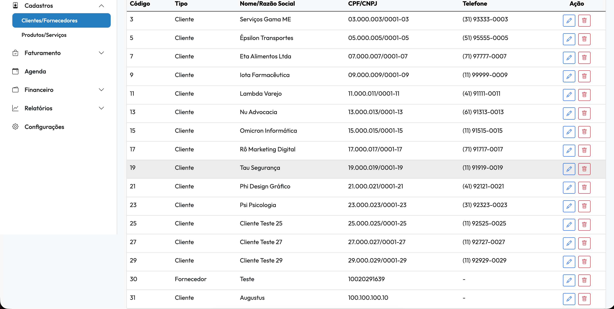
 |

| **Caso de Teste** | **CT07 - Buscar Cliente/Fornecedor** |
| :--- | :--- |
| **Requisito Associado** | **RF-03** - O sistema deve permitir o cadastro de clientes e fornecedores e exibir todos em uma lista com filtros. |
| **Evidência do Teste:** | 

📷 Ver Imagem
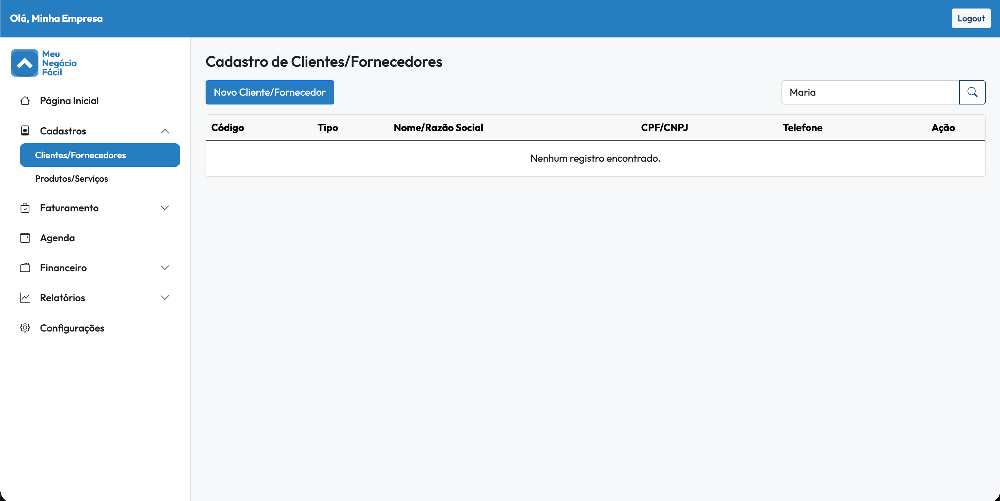
 |

| **Caso de Teste** | **CT08 - Excluir Cliente/Fornecedor** |
| :--- | :--- |
| **Requisito Associado** | **RF-03** - O sistema deve permitir o cadastro de clientes e fornecedores e exibir todos em uma lista com filtros. |
| **Evidência do Teste:** | 

📷 Ver Imagem
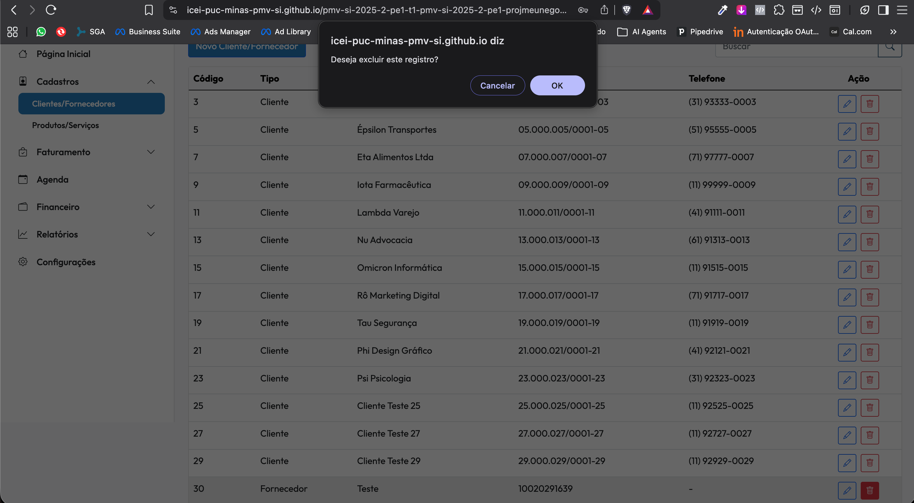
 |

| **Caso de Teste** | **CT09 - Adicionar Novo Produto** |
| :--- | :--- |
| **Requisito Associado** | **RF-04** - O sistema deve permitir cadastrar produtos e serviços e exibir todos em uma lista com filtros. |
| **Evidência do Teste:** | 

📷 Ver Imagem
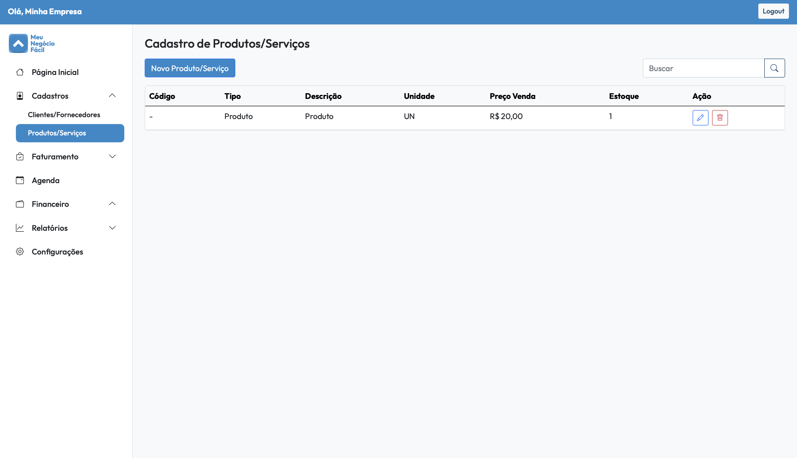
 |

| **Caso de Teste** | **CT10 - Adicionar Novo Serviço** |
| :--- | :--- |
| **Requisito Associado** | **RF-04** - O sistema deve permitir cadastrar produtos e serviços e exibir todos em uma lista com filtros. |
| **Evidência do Teste:** | 

📷 Ver Imagem
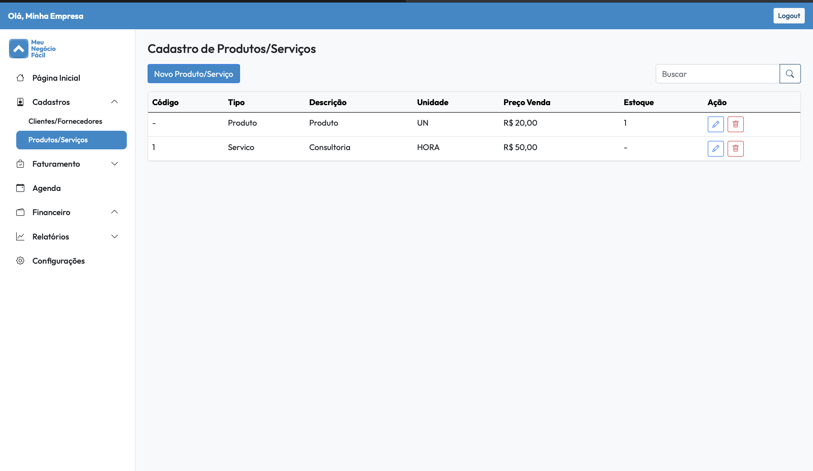
 |

| **Caso de Teste** | **CT11 - Lançar Venda de Produto (PDV)** |
| :--- | :--- |
| **Requisito Associado** | **RF-05** - O sistema deve permitir a emissão de venda de produtos, possibilitando a seleção de cliente, produtos e forma de pagamento. |
| **Evidência do Teste:** | 

📷 Ver Imagem
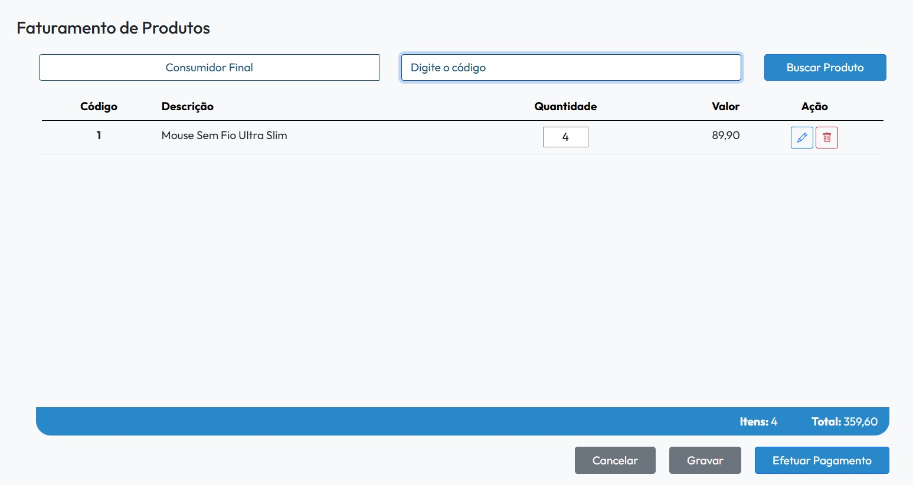
 |

| **Caso de Teste** | **CT12 - Finalizar Venda de Produto (Pagamento)** |
| :--- | :--- |
| **Requisito Associado** | **RF-05** - O sistema deve permitir a emissão de venda de produtos, possibilitando a seleção de cliente, produtos e forma de pagamento. |
| **Evidência do Teste:** | 

📷 Ver Imagem
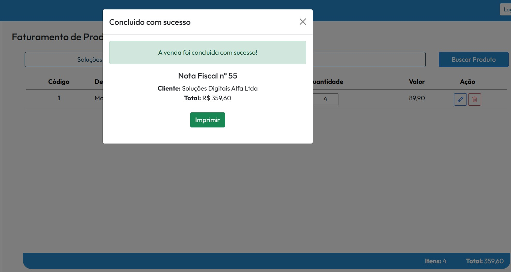
 |

| **Caso de Teste** | **CT13 - Lançar Venda de Serviço** |
| :--- | :--- |
| **Requisito Associado** | **RF-06** - O sistema deve permitir a emissão de serviços com seleção de cliente, serviços realizados, forma de pagamento e lançamento de insumos. |
| **Evidência do Teste:** | 

📷 Ver Imagem
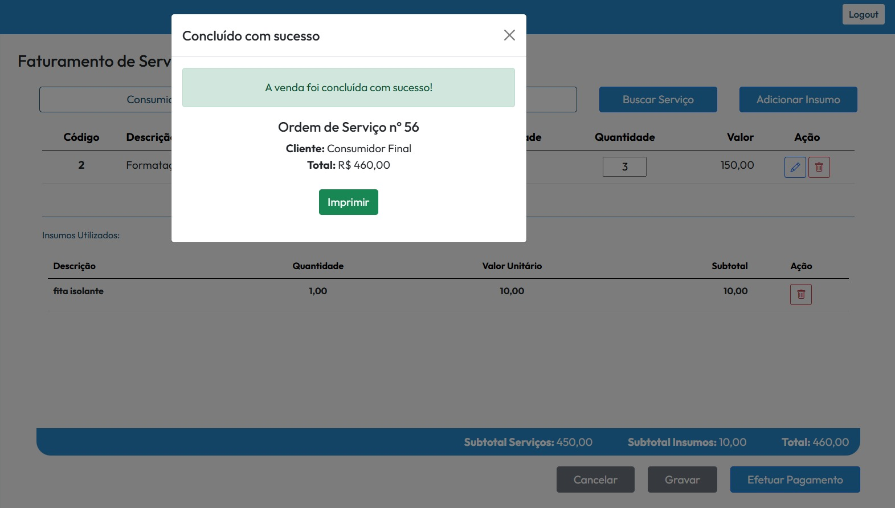
 |

| **Caso de Teste** | **CT14 - Adicionar Insumo ao Serviço** |
| :--- | :--- |
| **Requisito Associado** | **RF-06** - O sistema deve permitir a emissão de serviços com seleção de cliente, serviços realizados, forma de pagamento e lançamento de insumos. |
| **Evidência do Teste:** | 

📷 Ver Imagem
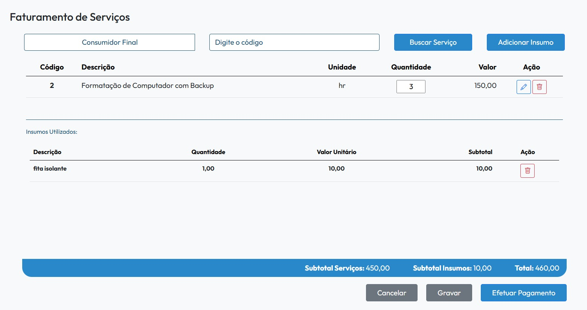
 |

| **Caso de Teste** | **CT15 - Gravar Venda como "Em Aberto"** |
| :--- | :--- |
| **Requisito Associado** | **RF-07** - O sistema deve permitir salvar as vendas e serviços como "em aberto", exibindo-os em uma lista e possibilitando editar ou finalizar o item desejado.   **RF-05** / **RF-06** |
| **Evidência do Teste:** | 

📷 Ver Imagem
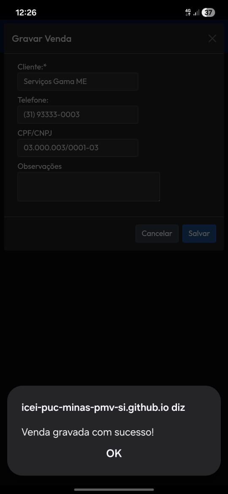
 |

| **Caso de Teste** | **CT16 - Editar Venda "Em Aberto"** |
| :--- | :--- |
| **Requisito Associado** | **RF-07** - O sistema deve permitir salvar as vendas e serviços como "em aberto", exibindo-os em uma lista e possibilitando editar ou finalizar o item desejado. |
| **Evidência do Teste:** | 

📷 Ver Imagem
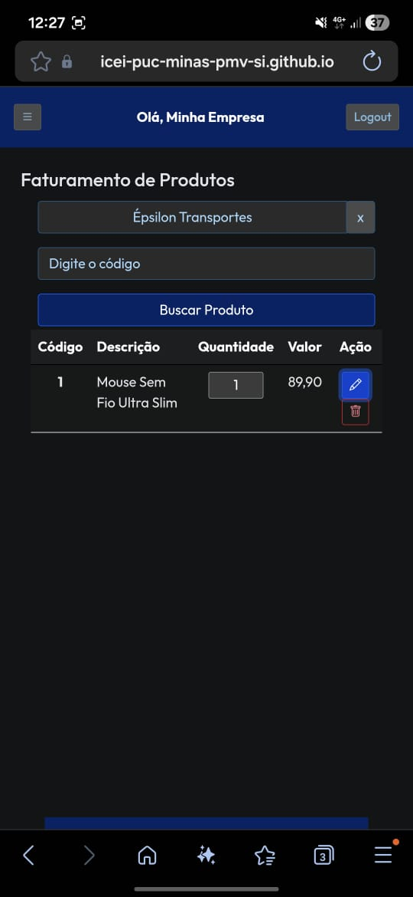
 |

| **Caso de Teste** | **CT17 - Adicionar Nova Conta a Pagar** |
| :--- | :--- |
| **Requisito Associado** | **RF-08** - O sistema deve permitir listar as faturas a receber e a pagar e permitir o cadastro de novas faturas. |
| **Evidência do Teste:** | 

📷 Ver Imagem
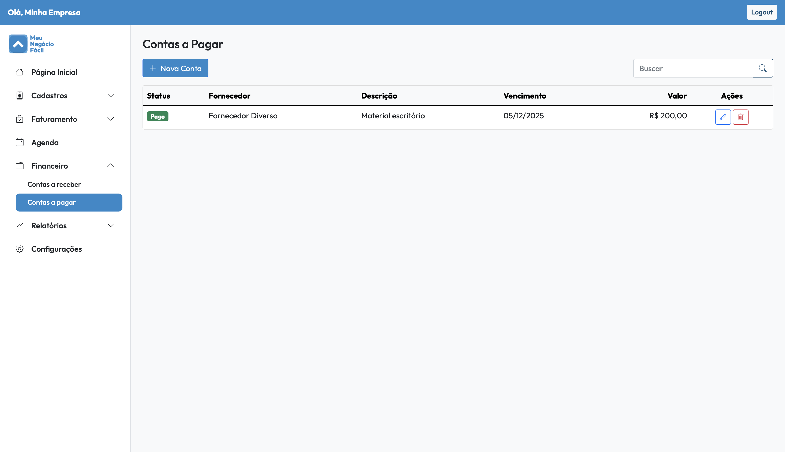
 |

| **Caso de Teste** | **CT18 - Adicionar Nova Conta a Receber** |
| :--- | :--- |
| **Requisito Associado** | **RF-08** - O sistema deve permitir listar as faturas a receber e a pagar e permitir o cadastro de novas faturas. |
| **Evidência do Teste:** | 

📷 Ver Imagem
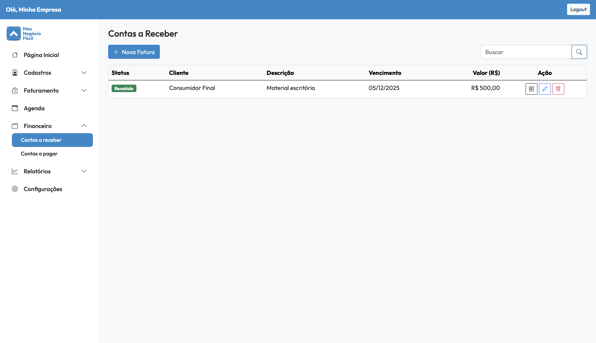
 |

| **Caso de Teste** | **CT19 - Adicionar Compromisso na Agenda** |
| :--- | :--- |
| **Requisito Associado** | **RF-09** - O sistema deve permitir ao usuário criar compromissos e administrá-los por meio de uma agenda e gerir compromissos recorrentes. |
| **Evidência do Teste:** | 

📷 Ver Imagem
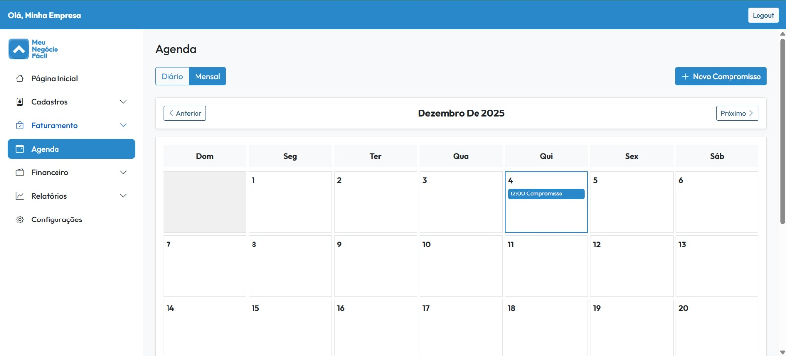
 |

| **Caso de Teste** | **CT20 - Alternar Visualização da Agenda (Diário/Mensal)** |
| :--- | :--- |
| **Requisito Associado** | **RF-09** - O sistema deve permitir ao usuário criar compromissos e administrá-los por meio de uma agenda e gerir compromissos recorrentes. |
| **Evidência do Teste:** | 

📷 Ver Imagem
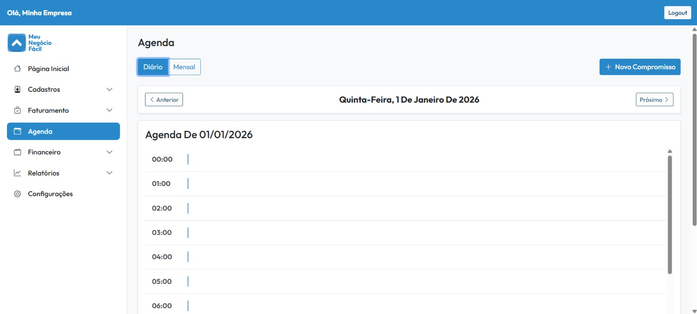
 |

| **Caso de Teste** | **CT21 - Teste de Responsividade (Menu Sidebar)** |
| :--- | :--- |
| **Requisito Associado** | **RNF-02** - Garantir que a interface seja responsiva, proporcionando acesso em dispositivos móveis. |
| **Evidência do Teste:** | 

📷 Ver Imagem
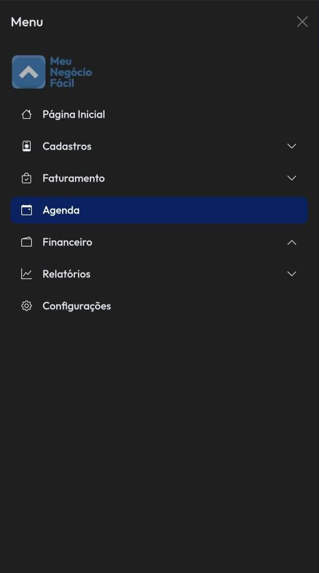
 |

| **Caso de Teste** | **CT22 - Interação com Filtros (Relatório Produtos/Serviços)** |
| :--- | :--- |
| **Requisito Associado** | **RF-10** - O sistema deve permitir a emissão de relatórios de vendas e serviços realizados, possibilitando filtrar por cliente ou por data.   **RNF-01** - A interface deve ser minimalista e proporcionar um aprendizado rápido. |
| **Evidência do Teste:** | 

📷 Ver Imagem
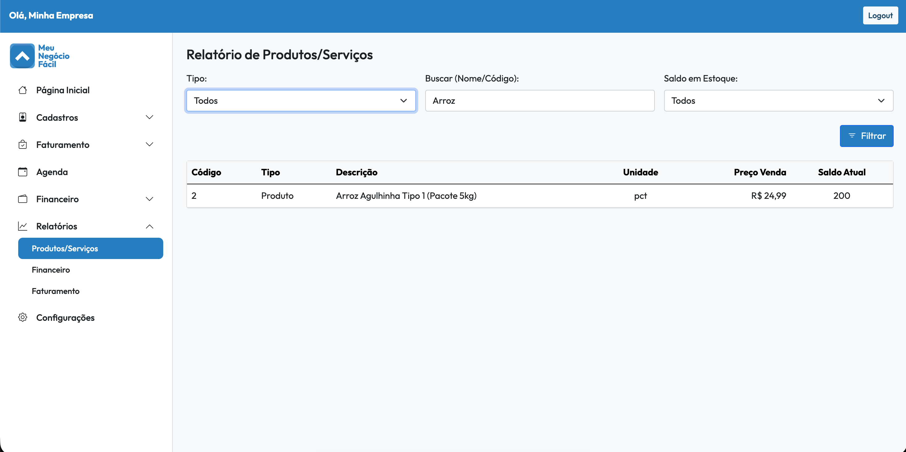
 |

| **Caso de Teste** | **CT23 - Interação com Filtros (Relatório Financeiro)** |
| :--- | :--- |
| **Requisito Associado** | **RF-11** - O sistema deve permitir a emissão de relatório de faturas pagas, a pagar, recebidas, a receber e de fluxo de caixa.   **RNF-01** - A interface deve ser minimalista e proporcionar um aprendizado rápido. |
| **Evidência do Teste:** | 

📷 Ver Imagem
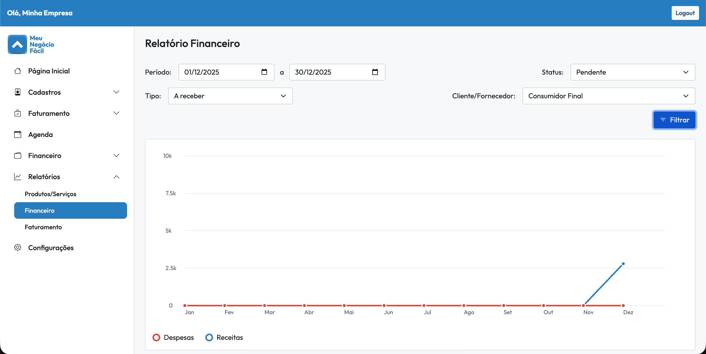
 |

| **Caso de Teste** | **CT24 - Interação com Filtros (Relatório Faturamento)** |
| :--- | :--- |
| **Requisito Associado** | **RF-12** - O sistema deve permitir a emissão de relatório de produtos, com saldos em estoque, ou de serviços, estilo tabela de preços.   **RNF-01** - A interface deve ser minimalista e proporcionar um aprendizado rápido. |
| **Evidência do Teste:** | 

📷 Ver Imagem
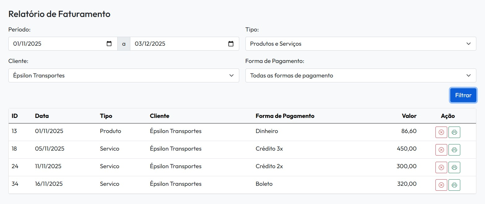
 |

| **Caso de Teste** | **CT25 - Teste de Usabilidade (Consistência da Interface)** |
| :--- | :--- |
| **Requisito Associado** | **RNF-04** - Garantir que cada usuário tenha acesso apenas aos dados da organização da qual faz parte. |
| **Evidência do Teste:** | 

📷 Ver Imagem
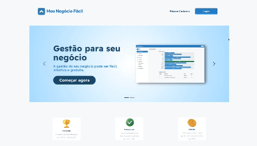
 |

# Avaliação dos Testes de Software

A execução dos testes de software, conforme detalhado no plano (CT01 a CT25), demonstrou que o **Meu Negócio Fácil** atingiu um nível satisfatório para esta etapa do desenvolvimento. Abaixo, detalhamos os pontos fortes, as falhas mitigadas e necessidades de melhoria.

**Pontos Fortes Identificados:**

* **Conformidade:** Todas as funcionalidades críticas, como **Faturamento** (Produtos e Serviços) e **Controle Financeiro** (Contas a Pagar/Receber), estão funcionais conforme os requisitos. Os cálculos de totais no PDV e a gravação de vendas "Em Aberto" funcionaram corretamente.
* **Validações de Segurança e Dados:** O controle de acesso está funcionando corretamente (**RF-02/RNF-01**), impedindo o acesso direto a páginas internas via URL sem login prévio. As validações de formulário, como a verificação de senhas coincidentes no cadastro, impediram a entrada de dados inconsistentes.
* **Responsividade e Interface:** O teste de responsividade (**RNF-02**) demonstrou que a aplicação se adapta a dispositivos móveis, com o menu lateral (sidebar) funcionando corretamente no modo *offcanvas*.

**Pontos Fracos e Desafios:**

* **Dependência de Testes Manuais:** A verificação atual depende inteiramente da execução manual dos testes. Isso torna o processo de lento a cada nova funcionalidade implementada.
* **Feedback Visual em Processos Assíncronos:** Embora funcionais, alguns processos assíncronos poderiam beneficiar-se de feedbacks visuais,como *spinners* de carregamento, caso a conexão de internet esteja lenta, para evitar cliques duplos do usuário.

**Melhorias Geradas e Próximos Passos:**

Com base nestes resultados, os principais *bugs* foram corrigidos. Futuramente seria desejável:

1.  Implementar **testes unitários automatizados** para as funções de cálculo financeiro, reduzindo a chance de erro na verificação.
2.  Refinar a **acessibilidade** dos modais e formulários para garantir que a navegação via teclado seja tão fluida quanto a via mouse.

<!-- ## Testes de unidade automatizados (Opcional)

Se o grupo tiver interesse em se aprofundar no desenvolvimento de testes de software, ele podera desenvolver testes automatizados de software que verificam o funcionamento das funções JavaScript desenvolvidas. Para conhecer sobre testes unitários em JavaScript, leia 0 documento  [Ferramentas de Teste para Java Script](https://geekflare.com/javascript-unit-testing/). -->

# Testes de Usabilidade

O objetivo do Plano de Testes de Usabilidade é definir como serão coletadas as informações quanto à expectativa dos usuários em relação à funcionalidade da aplicação de forma geral.

Para tanto, o planejamento prevê a execução de quatro cenários de teste, cada um baseado na definição das histórias de usuário estabelecidas na etapa de especificação do projeto.

Serão convidados de 3 a 5 voluntários que se encaixem no perfil do público-alvo (pequenos empreendedores) para averiguar os seguintes indicadores:

* **Taxa de sucesso:** Verifica se o usuário conseguiu ou não executar a tarefa proposta.
* **Satisfação subjetiva:** Avalia como o usuário se sentiu em relação à execução da tarefa, utilizando a escala Likert de 1 a 5:
    1.  Péssimo
    2.  Ruim
    3.  Regular
    4.  Bom
    5.  Ótimo
* **Tempo para conclusão da tarefa:** Medido em segundos, para comparação posterior com o tempo ideal (benchmarking) realizado por um especialista (desenvolvedor).

Visando respeitar as diretrizes da Lei Geral de Proteção de Dados (LGPD), as informações pessoais dos participantes não serão armazenadas, sendo identificados apenas por códigos (ex: Usuário 01) nos registros.

<!-- > **Ferramentas sugeridas para aplicação:**
> - [UX Tools](https://uxdesign.cc/ux-user-research-and-user-testing-tools-2d339d379dc7) (Softwares para gravação de tela e cronometragem). -->

# Planejamento, Registro e Avaliação de Testes de Usabilidade

Este documento registra o planejamento, a execução e a avaliação final dos testes de usabilidade realizados pela equipe de desenvolvimento para validar as principais funcionalidades do sistema.

## Cenários de Teste de Usabilidade

Abaixo estão os cenários executados para validar a integridade e fluidez do sistema.

| Nº do Cenário | Descrição da Tarefa | Objetivo da Validação |
| :--- | :--- | :--- |
| **1** | **Cadastro e Primeiro Acesso:** Simule ser um novo usuário. Realize o cadastro de uma nova conta (PJ) e faça o login para acessar o Dashboard. | Verificar se o fluxo de criação de conta está funcional e se o redirecionamento para o Dashboard ocorre sem erros de sessão. |
| **2** | **Gestão de Inventário:** Acesse o módulo de cadastros e insira um novo produto (ex: "Mouse Sem Fio"), definindo preço e unidade. | Garantir que o CRUD de produtos está persistindo os dados corretamente no banco e a navegação está fluida. |
| **3** | **Fluxo de Venda (PDV):** Realize uma venda de 2 unidades de um produto para um cliente cadastrado, selecione o pagamento e finalize. | Validar a eficiência do processo de checkout, cálculo de totais e baixa de estoque (se aplicável). |
| **4** | **Análise Gerencial:** Acesse o Relatório Financeiro, filtre por "A receber" e verifique a renderização do gráfico de resultados. | Confirmar se os filtros de data/tipo estão funcionando e se os gráficos carregam os dados corretos da base. |

---

## Registro dos Testes de Usabilidade

Abaixo estão os resultados quantitativos obtidos durante a validação interna com a equipe (3 integrantes).

### Resultados: Cenário 1 (Cadastro e Login)

| Participante | Sucesso (Sim/Não) | Nota de Qualidade (1-5) | Tempo (s) |
| :--- | :--- | :--- | :--- |
| Aluno 01 | Sim | 5 | 1m43s |
| Aluno 02 | Sim | 5 | 2m00s |
| Aluno 03 | Sim | 5 | 1m17s |
| **Média** | **Sim** | **5** | **1m40s** |

### Resultados: Cenário 2 (Cadastro de Produto)

| Participante | Sucesso (Sim/Não) | Nota de Qualidade (1-5) | Tempo (s) |
| :--- | :--- | :--- | :--- |
| Aluno 01 | Sim | 5 | 36s |
| Aluno 02 | Sim | 5 | 1m13s |
| Aluno 03 | Sim | 5 | 55s |
| **Média** | **Sim** | **5** | **54s** |

### Resultados: Cenário 3 (Realização de Venda)

| Participante | Sucesso (Sim/Não) | Nota de Qualidade (1-5) | Tempo (s) |
| :--- | :--- | :--- | :--- |
| Aluno 01 | Sim | 5 | 19s |
| Aluno 02 | Sim | 5 | 43s |
| Aluno 03 | Sim | 5 | 21s |
| **Média** | **Sim** | **5** | **28s** |

### Resultados: Cenário 4 (Relatório Financeiro)

| Participante | Sucesso (Sim/Não) | Nota de Qualidade (1-5) | Tempo (s) |
| :--- | :--- | :--- | :--- |
| Aluno 01 | Sim | 5 | 19s |
| Aluno 02 | Sim | 5 | 24s |
| Aluno 03 | Sim | 5 | 33s |
| **Média** | **Sim** | **5** | **25s** |

---

## 3. Evidências de Execução 

Registros visuais da execução completa de todos os cenários.

  
🎥 <strong>Aluno 01</strong> - Ver Execução Completa

   
  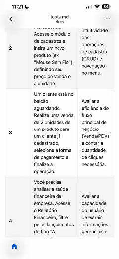

 

  
🎥 <strong>Aluno 02</strong> - Ver Execução Completa

   
  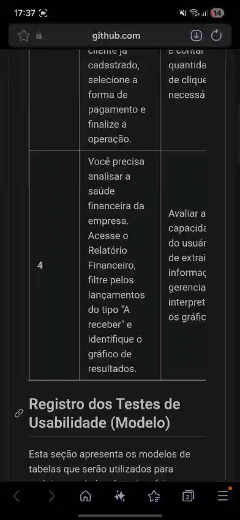

 

  
🎥 <strong>Aluno 03</strong> - Ver Execução Completa

   
  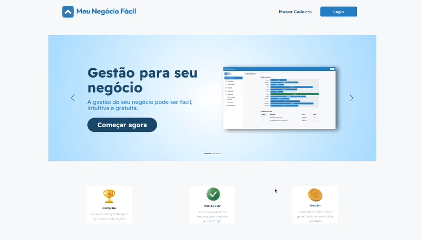

---

## Avaliação dos Testes de Usabilidade

Com base nos dados coletados e nos critérios de aceitação definidos no planejamento, apresentamos a análise detalhada da usabilidade do sistema.

### Análise de Eficácia (Taxa de Sucesso)
**Resultado: 100% de Sucesso.**
Todos os participantes (Alunos 01, 02 e 03) conseguiram completar as tarefas propostas sem erros impeditivos ou necessidade de intervenção externa.
* **Conclusão:** O sistema demonstra estabilidade e clareza nos fluxos principais. A ausência de falhas indica que as regras de negócio e validações estão funcionando conforme o esperado.

### Análise de Eficiência (Tempo de Execução)
Os tempos médios obtidos foram comparados com a complexidade esperada para cada tarefa.

* **Destaque Positivo (Cenário 3 - Venda PDV):** O tempo médio de **28 segundos** para realizar uma venda completa é um indicador excelente de produtividade. Isso sugere que o design da tela de vendas é intuitivo e permite operação rápida.
* **Variação de Tempo:** Observou-se uma variação natural entre os usuários (ex: no Cenário 2, tempos variaram entre 36s e 1m13s). Como ambos completaram a tarefa com sucesso e nota máxima, a diferença é atribuída à familiaridade individual com a digitação, e não a um bloqueio da interface.

### Análise de Satisfação
**Média Geral: 5.0 / 5.0 (Excelente).**
A nota máxima atribuída por todos os testadores em todos os cenários indica que a interface não gerou frustração ou carga cognitiva excessiva.
* **Interpretação:** A interface é amigável e o feedback visual do sistema (mensagens de sucesso, carregamento de gráficos) é adequado.

### Conclusão Final

O sistema foi validado com êxito em seus fluxos críticos (Cadastro, Estoque, Venda e Relatórios).

* **Status do Teste:** ✅ **Aprovado**
